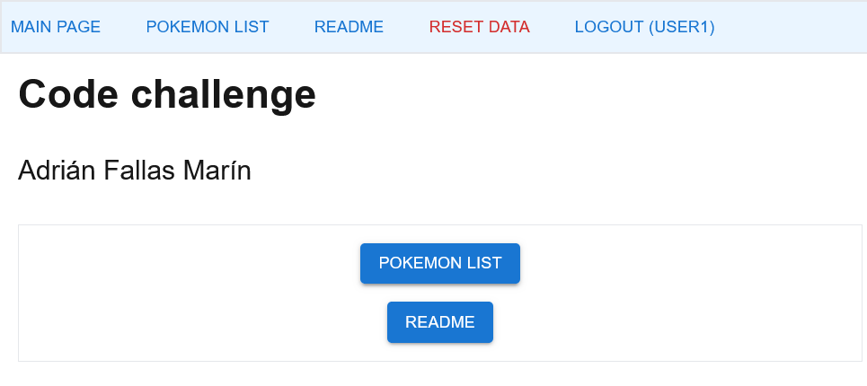
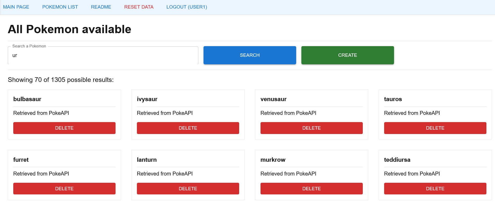
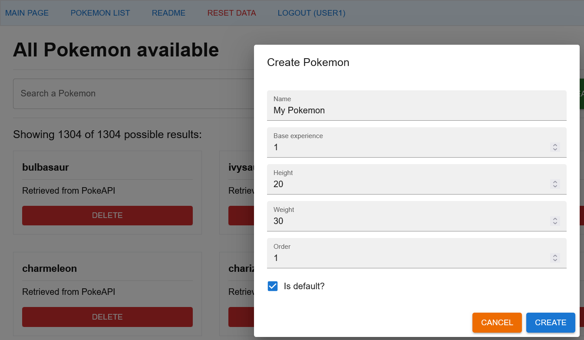
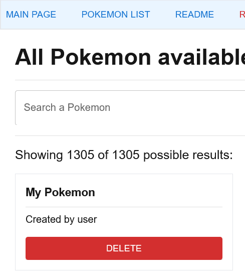
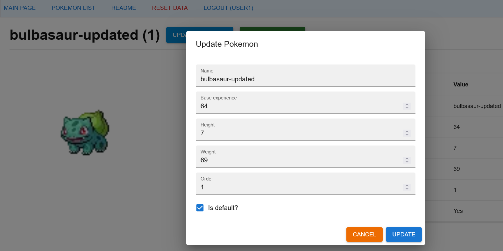
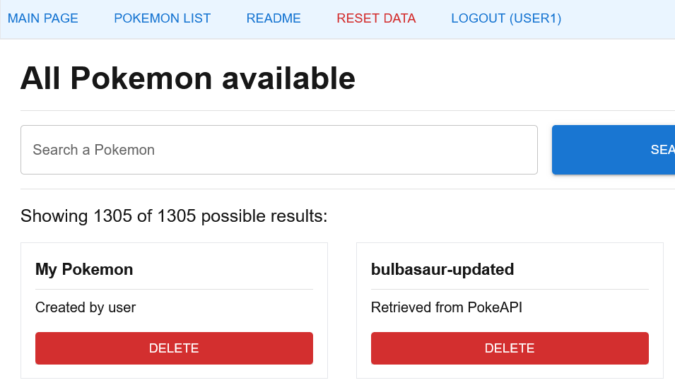
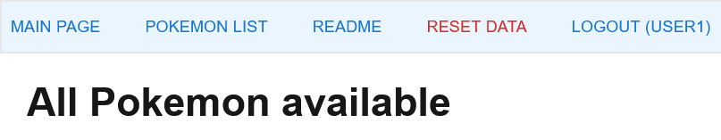
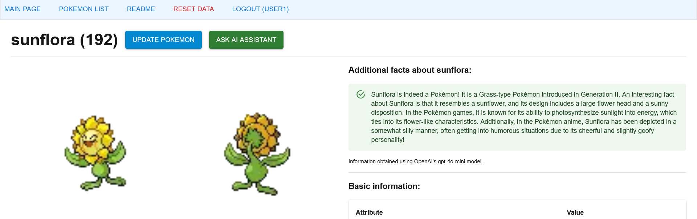

# code-challenge

Adrián Fallas Marín's code challenge solution: [https://fmadrian-codechallenge.netlify.app](https://fmadrian-codechallenge.netlify.app).

## Description of solution

The solution developed is a web application to show different Pokémon and manage some of their data. The data is extracted using PokeAPI's API or is input by the user.

The users can also ask an AI assistant to give them additional facts about a Pokémon they are currently seeing.

### Web client

Made with Next.js alongside MUI, axios, Jest (testing), and zustand libraries. In addition, the application uses PokeAPI's API to retrieve basic Pokémon data and an external API to get additional information about the Pokémon.

### External/AI API

The application uses the OpenAI Completions API to get additional information or facts about the different Pokémon.

To avoid exposing OpenAI's API key on the web client, I created an API with one endpoint that receives a Pokémon's name and forwards it to OpenAI's gpt-4o-mini model.

The API was created with Express and deployed using Netlify Functions. The URL to its repository is: [https://github.com/fmadrian/code-challenge-chatapi](https://github.com/fmadrian/code-challenge-chatapi).

## AI integration

### OpenAI's Completions API

OpenAI's Completions API provides complementary facts about the Pokémon selected. This improves the experience of searching a Pokémon's data, as it offers data that is not given by PokeAPI.

### GitHub Copilot

I used GitHub Copilot to autocomplete the application's code.

This was very useful as it would give me snippets of code I could use as a reference to write unit and integration tests. Additionally, the autocomplete feature allowed me to speed up the development of the application.

### LanguageTool

I used [LanguageTool's grammar checker](https://languagetool.org/) to check grammar, spelling, and style in this README file. It had a considerable impact by correcting errors I hadn't previously seen.
## Application's URL and users

### Application's URL

The application's URL is [fmadrian-codechallenge.netlify.app](https://fmadrian-codechallenge.netlify.app).

### Users

This is a list of the users available in the application:


```
username/password: user1/123
username/password: user2/123
username/password: user3/123
```

## Tests

I used Jest and React Testing Library to implement unit and integration tests.

To run the tests, use the following command in the root folder of this project.

```
npm run test
```

The tests have the same structure as the components they are testing. They are located inside the test directory and in the same subdirectory as the component they are testing.

```
Example

+ __tests__
| + app
| | + login
| | | + page.test.tsx
| + components
| | + Header.test.tsx
....
....
....
+ app
| + login
| | + page.tsx
+ components
| + Header.tsx

```

## Locally run the application

### Requisites

Before running the application, you need:

1. An OpenAI Completions API key.

2. Rename the file ***.env.example*** to ***.env*** and fill in the missing environment variables.

### Command

To run the application, use the following command in the root folder of this project.

```
npm run dev
```

Then you can access the application by going to [http://localhost:3000](http://localhost:3000).

## How to use the application?

### Search Pokémon

**If no name is given, all Pokémon in the list will be returned.**

To search for a Pokémon, follow these steps:

1. Click the ***POKEMON LIST button***.

2. Type a name in the ***search bar***.

3. Click the ***SEARCH button***.

### Create Pokémon





To create a Pokémon, follow these steps:

1. Click the ***POKEMON LIST button***.

2. Click the ***CREATE button***.

3. Fill out the form.

4. Click the ***CREATE button*** inside the **form**.



### See Pokémon's information

To create a Pokémon's, follow these steps:

1. Search a Pokémon.

2. Click the ***Pokémon's card***.



### Update Pokémon

To update a Pokémon, follow these steps:

1. Open a Pokémon's information.

2. Click the ***UPDATE button***.

3. Make changes on the form.

4. Click the ***UPDATE button*** inside the **form**.



### Delete Pokémon

To delete a Pokémon, follow these steps:

1. Search a Pokémon.

2. Click the ***DELETE button***.



### Restart / fill data

Restarting the application's data will fill it with Pokémon from PokeAPI.

To restart the application's data, follow this step:

1. Click ***RESET DATA button*** in the **header**.



### Ask AI assistant

To ask the AI assistant additional information about a Pokémon, follow these steps.

1. Open a Pokémon's information.

2. Click the ***ASK AI ASSISTANT button***.

3. Wait for the information to load.

